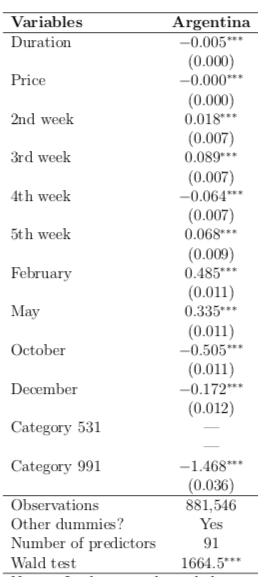
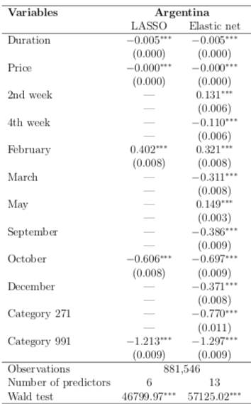

# Analyzing Online Prices by Using Machine Learning Techniques Analysis
This project seeks a way to predict the timing of price adjustment. This repository shows the analysis (econometrics) part of the project. The goal of this analysis is finding a causality between price change timing and observable features.

[Analyzing Online Prices by Using Machine Learning Techniques](https://www.researchgate.net/publication/324749650_Analyzing_online_price_by_using_machine_learning_techniques?_sg=3UdZEoizQYN68GgK46_HMGToTjE9PHEaxeP5qUlSGBwud7scncmPiAud836hrR_waHbiEWnVNc2MWi-kAhViKDekejAW9Hpqhqg3PDtw.60jGQ3FndrHiF_rLxx7OBxeiX1dU9rbvuV0) 
(2018) (master thesis) - Analysis part source code.
Also documented in my [medium blog post](https://medium.com/analytics-vidhya/can-we-predict-a-price-adjustment-in-an-online-supermarket-by-using-machine-learning-and-ab5b762abac0).

## Table of contents
* [Requirements](#requirements)
* [Regression Analysis](#regression-analysis)
* [Results](#results)

## Requirements
```
R 3.5.1
logistf_1.23      
speedglm_0.3-2    
MASS_7.3-50       
Matrix_1.2-14    
lubridate_1.7.4   
ggplot2_3.1.0     
dplyr_0.7.8       
data.table_1.11.8
```

## Regression Analysis
The main focus of econometrics analysis is to find causality between dependent variables and an independent variable. Often statistical inferences are core interest in this discipline. Also econometrics research deals with relatively small datasets, and a model should be simpler, whereas machine learning analysis uses larger datasets, and a model is often more complex in order to improve its prediction power.

This dissertation uses logistic regression to predict the price adjustment as a benchmark model. To understand what are the most important features to explain the firm’s price adjustment behaviour, this dissertation uses feature selection algorithms (LASOO and Elastic net) for comparison.

This price change data is a class imbalanced dataset. To deal with it, this dissertation uses the Firth penalised logistic regression, which can incorporate the imbalanced data set. The model is expressed as below.

## Results
Here are some results from the benchmark logistic regression. In the parentheses below coefficients indicate the standard errors. ∗∗∗ denotes significance at 0%, ∗∗ at 0.1%, and ∗ at 5%, . at 10%.



The Wald test is significant at 0%, which means all the features are informative in this model. The duration variable (days since the last adjustment) is negative. That indicates a price change less likely to happen for every additional day, but the influence of additional week is little. Coefficients of price variable are quite close to zero but negative. From this result, it can be analysed that no matter how expensive the product, the price itself has a quite small influence on a price adjustment. This result is counterintuitive since usually more expensive products have elastic demand, which means that consumers are more sensitive to expensive products. Firms must consider the demand to maximise the profit, which indicates that a firm has to be more attentive to the price setting of an expensive product. However, this result shows that price is relatively less influence to estimate price changes.

Now this dissertation uses LASSO and Elastic net to select some of the most important features. As the characteristic of LASSO, it shrunk its coefficients to zero more than the Elastic net. After selected features, I applied Firth penalised logistic regression with those features. Following are the results of them.



The models yield quite similar results to the benchmark logistic regression model. The Wald tests are significant at 0% for both models. Both models find that price variable has a little power to predict a price adjustment. Also duration variable shows a negative but small effect on price adjustment on an additional day. Although their less predicting power, the LASSO and elastic net demonstrate that those two variables are the most important variables in the models. Secondly, this study confirms that there are several categories of products that have a flexible price setting, and others are sticky.


